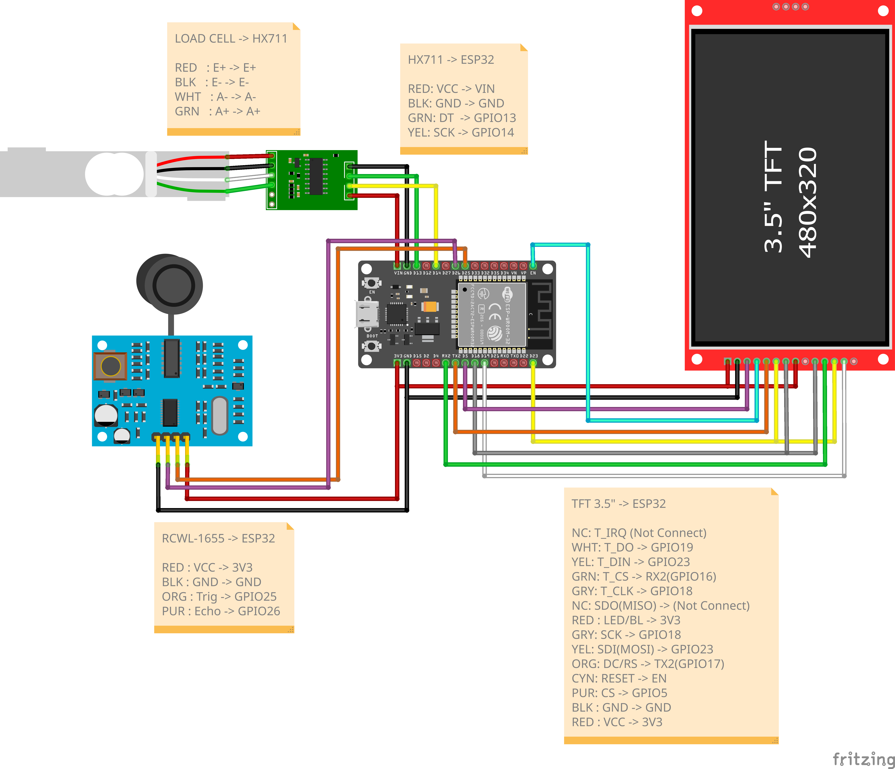

# ESP32 BMI TH

โปรเจกต์ระบบตู้ตรวจสุขภาพอัตโนมัติ ควบคุมด้วย ESP32 ทำหน้าที่ชั่งน้ำหนัก, วัดส่วนสูง และคำนวณค่า BMI พร้อมแสดงผลผ่านหน้าจอ TFT Touch Screen และบันทึกข้อมูลขึ้น Google Sheets

## 🛠️ Hardware Components
- **Microcontroller:** ESP32
- **Display:** หน้าจอ TFT LCD พร้อมระบบสัมผัส (ILI9488)
- **Sensors:**
  - `HX711` โมดูลขยายสัญญาณ Load Cell (สำหรับวัดน้ำหนัก)
  - `RCWL-1655` เซนเซอร์วัดระยะทางแบบอัลตราโซนิก (สำหรับวัดส่วนสูง)

## 🔌 Wiring Diagram

## 📚 Required Libraries
โปรเจกต์นี้จำเป็นต้องติดตั้งไลบรารีดังต่อไปนี้ใน Arduino IDE ก่อนทำการคอมไพล์:

1. **[HX711](https://github.com/RobTillaart/HX711)** โดย [Rob Tillaart] - (ใช้งานเวอร์ชัน 0.6.3)
   - *วิธีติดตั้ง:* ค้นหาใน Library Manager ว่า "HX711" หรือดาวน์โหลดจาก [GitHub](https://github.com/RobTillaart/HX711)
2. **[TFT_eSPI](https://github.com/Bodmer/TFT_eSPI)** โดย Bodmer - (ใช้งานเวอร์ชัน 2.5.43) 
   - *วิธีติดตั้ง:* ค้นหาใน Library Manager ว่า "TFT_eSPI" หรือดาวน์โหลดจาก
      [GitHub](https://github.com/Bodmer/TFT_eSPI)

   - *หมายเหตุ:* สำหรับ `TFT_eSPI` ผู้ใช้ต้องเข้าไปแก้ไขไฟล์ `User_Setup_Select.h` และ `User_Setups/Setup21_ILI9488.h`

   - **วิธีการแก้ไข:**
      - ในไฟล์ `User_Setup_Select.h` ให้ comment `#include <User_Setup.h>` บรรทัดที่ 27 และ uncomment `#include <User_Setups/Setup21_ILI9488.h> ` บรรทัดที่ 52
      - ในไฟล์ `User_Setups/Setup21_ILI9488.h` ให้แก้ไข pin ดังนี้
         - #define TFT_MISO 19
         - #define TFT_MOSI 23
         - #define TFT_SCLK 18
         - #define TFT_CS    5
         - #define TFT_DC   17
         - #define TFT_RST  -1
         - #define TOUCH_CS 16
         - #define SPI_FREQUENCY  40000000
         - #define SPI_READ_FREQUENCY  16000000
         - #define SPI_TOUCH_FREQUENCY  2500000

---

## 🚀 How to use
1. ติดตั้งไลบรารีทั้งหมดให้ครบถ้วน
2. ตรวจสอบการต่อสายเซนเซอร์ให้ตรงกับพินที่กำหนด
3. เปิดไฟล์ `ESP32-BMI-TH.ino` ใน Arduino IDE
4. เลือกบอร์ดและพอร์ตที่ถูกต้อง แล้วกด Upload